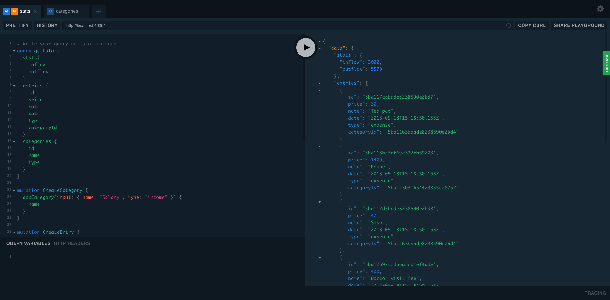

# Cass

Cass is a digital wallet, which can track your expenses & earnings. Very minimal backend, implemented with nodejs, MongoDB & GraphQL.

## Installation

```
$ npm i
```
Change your MongoDB database URL at `config.js`

## Start the server
```
$ node index.js
```

## Generate dummy data
```
$ node seedDemoData.js
```

## Queries & mutations
Let's play with the backend. Go to host URL, in my case; it is `http://localhost:4000/`

Query:
```javascript
query getData {
  stats{
    inflow
    outflow
  }
  entries {
    id
    price
    note
    date
    type
    categoryId
  }
  categories {
    id
    name
    type
  }
}
```
You will get something like this.


Mutations:
```javascript
mutation CreateCategory {
  addCategory(input: { name: "Bills & Utilities", type: "expnese" }) {
    name
  }
}

mutation CreateEntry {
  addEntry(input: {
    categoryId: "5ba113b31654423835c78752",
    price: 200,
    note: "Sound box",
    date: "2018-09-18T15:18:50.158Z",
  }) {
    id
  }
}

mutation DeleteCategory {
  deleteCategory(id: "5ba11fc59aad9f3ac65e1c46") {
    name
  }
}
```

## Author

**Joynal Abedin** - [Joynal](https://twitter.com/joynaluu)

## License

This project is licensed under the MIT License - see the [LICENSE.md](./license.md) file for details